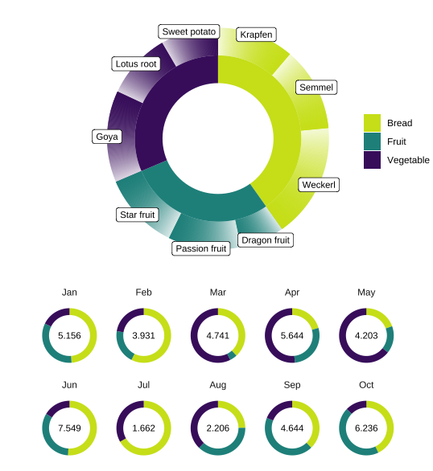
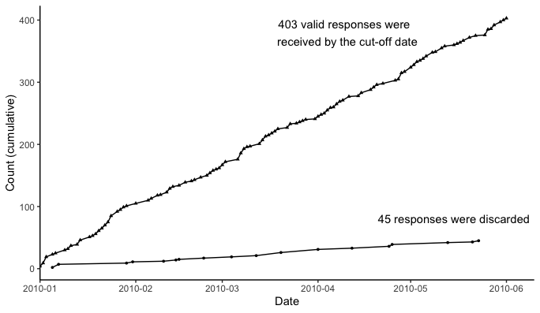

Figures for reports, and a basic project report in R Markdown.

## Donut chart of expenses by month and category

The main donut shows a breakdown by category, with two rings, where the outer ring shows subsets of categories. The smaller donuts show the monthly breakdown and are labelled with the monthly total. The donuts are colour-coded according to superset categories. The figure below is arranged for vertical (mobile) display; a horizontal option with a shared legend is also provided. See end of script for main references. NB: it is not recommended to go a whole month without consuming vegetables. 

## Cumulative line graph

Questionnaires were distributed to participants as part of project evaluation. Plot a figure to show how many responses were received over time and how many were discarded (e.g. invalidated).

